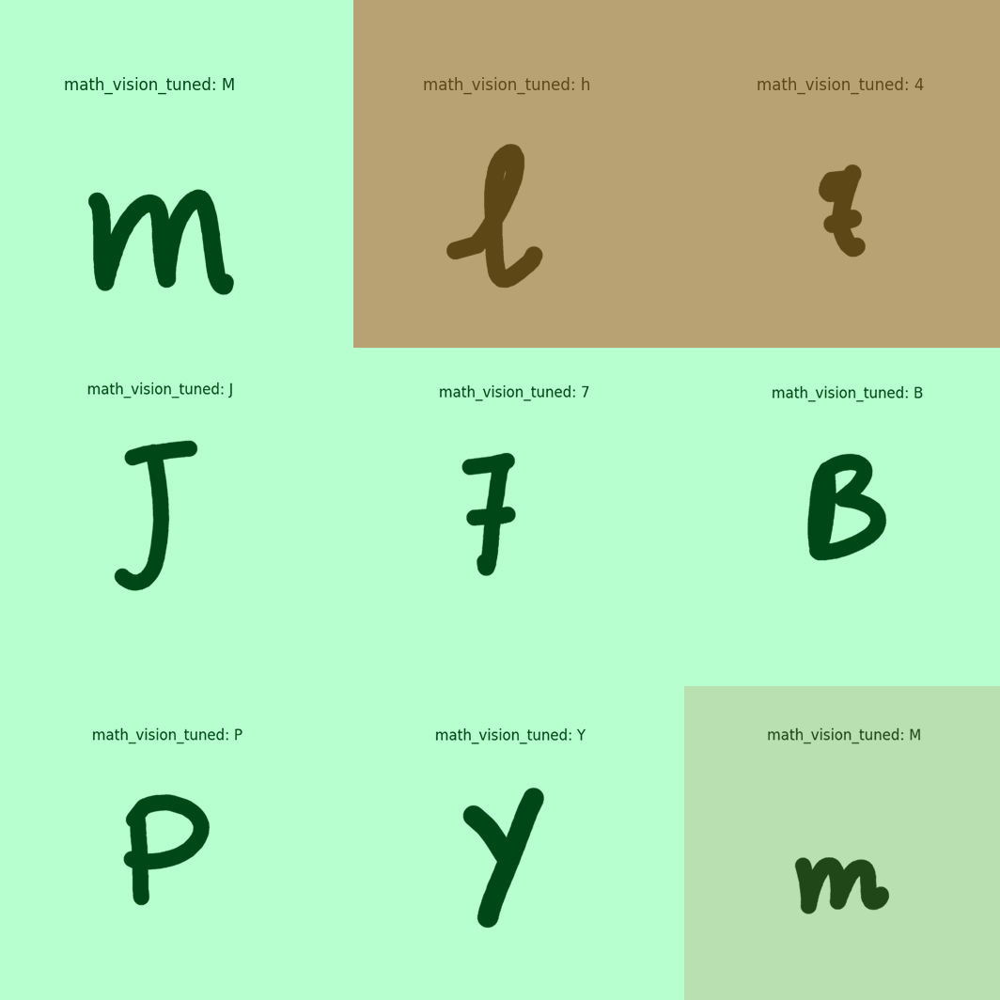
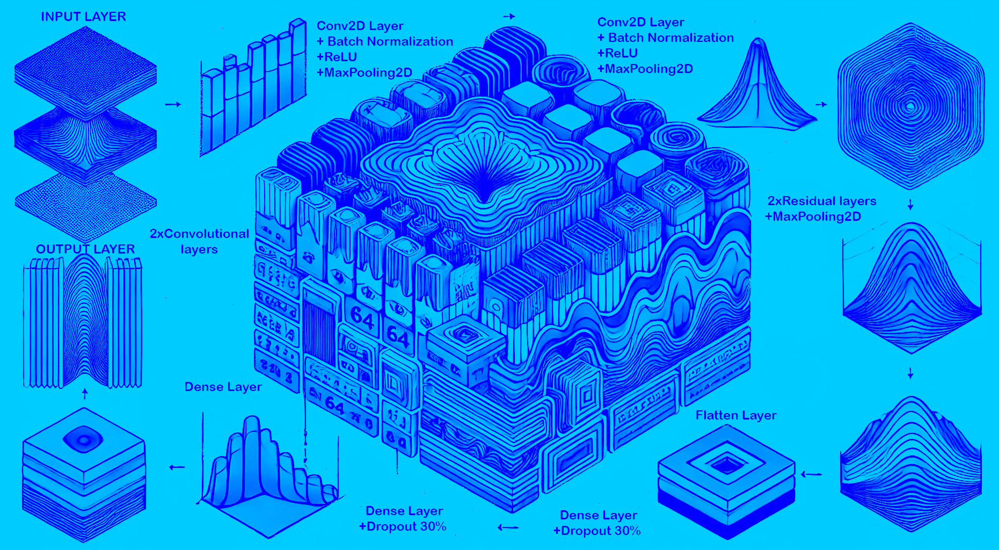
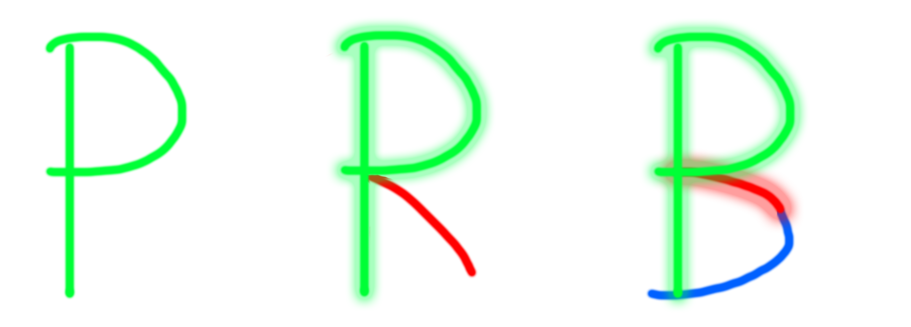

# Math Vision

This project is focused on developing a vision-based model that can recognize mathematical symbols and characters. The notebook ``'math_vision_model.ipynb'`` includes all necessary steps from importing data to training, fine-tuning, and testing the model.

## Table of Contents

1. [Introduction](#introduction)
2. [Training Data](#training-data)
3. [Evaluation of Math-Vision](#evaluation-of-math-vision)
4. [Describing the model](#describing-the-model)
5. [Optimizing the model](#optimizing-the-model)
6. [Final Words](#final-words)
7. [License](#license)

## Introduction

This is a model designed to predict images of mathematical symbols including numbers and alphabets. The goal of this task is to later deploy it for solving simple math problems just from a picture of it (seperate repo).

If you want the access to the model you can find it at 

[models\math-vision-resnet_model.h5](https://drive.google.com/file/d/1u6BTxlCiS0XiHLW9QY0MCDEjmsmpjOFV/view?usp=drive_link)


[models\math-vision-post-tuning-resnet.h5](https://drive.google.com/file/d/1b8WcXg93NnyNutt1khhZNF16oABGxKPU/view?usp=drive_link)  $\;\;\;$ `this one is fine tuned and has overall better accuracy and reliablity`


## Requirements

- Python 3.9+
- TensorFlow 2.x
- NumPy
- Matplotlib
- Any additional dependencies listed in the notebook

## Training Data

For this model, I grabbed the [EMNIST](https://www.kaggle.com/datasets/crawford/emnist) by class dataset from kaggle, and merged it with synthetic data I generated using `synthetic_image.py` refer to [this](docs/synthetic_data_readme.md) for more information on how I generated the sythetic aspect of the dataset.

Moreover I also fine tuned my model on another dataset, credits to [Mathematical Symbols](https://www.kaggle.com/datasets/amitamola/mathematics-symbols-data).

The classes inside the dataset consists of the following characters:
```
A, B, C, D, E, F, G, H, I, J, K, L, M, N, O, P, Q, R, S, T, U, V, W, X, Y, Z,
a, b, c, d, e, f, g, h, i ,j, k, l, m, n, o, p, q, r, s, t, u, v, w, x, y, z,
0, 1, 2, 3, 4, 5, 6, 7, 8, 9, !, @, #, $, %, ^, &, *, (, ), -, _, =, +, ',', :,
;, <, >, /, ?, {, }, |, [, ], .
```

You can grab the dataset that I used for training `math-vision` model from my [google drive link =)](https://drive.google.com/file/d/1S3RTySSDCfyD3eaQuMIWb1xtd_LTfsfH/view?usp=drive_link)

> [!NOTE]
>Now a simple disclaimer: I don't claim any images inside this `'images.zip'` file, it is a collection of all the data I trained on and I am only providing it for educational and research purposes. I don't intend or want to use it commercially.


## Evaluation of Math Vision

Now to be honest, I probably developed more than 100 models in last few days, in order to achive higher accuracy and lower loss, but I believe with my current knowledge about machine learning I suspect number of classes contributes to the complexity of training such a model.

Nevertheless I managed to achieve approx 88% accuracy with 10% loss on validation set,

These numbers don't stand for what they seem, only results can make you understand what I mean.<br />

Here's how my math-vision model performed on a sample of 9 images.


<br /><br />

And here's the performance of my tuned version.


<br />

It's obvious the tuned model doesn't blunder as much as the non tuned one.
## Describing the model
So for the model I utilised residual blocks to cook up my own resnet model, the goal was for it catch on the character classes and distinguish them, hence I thought a resnet model would be most appropriate.

<br /><br />
as you can see above, the model was quite complex that enabled it to catch on to characters.

## Optimizing the model

Inside `'math_vision_model.ipynb'` you will notice several callback functions when fitting on the dataset.

I used Adam as my optimizer with an initial learning rate of `0.0001` which was reduced by a factor of 0.2 every 3rd epoch whenever the validation loss arrived plateau, with the lower limit of 1e-7.

And for the loss function, I experimented alot and realised due to the vast number of classes categorical crossentropy is not quite optimal for our problem.

$Categorical(p, q) = -\sum{{\substack{\\x\in classes}}\;p(x)\;\log{\;q(x)}}$

This is how categorical crossentropy loss function works.

And for our problem focal loss function is a better alternative, it helps model to focus well on overlapping features of the classes and enables it to distinguish the model better.

$Focal(\gamma, \alpha) = \sum{\substack{i=n\\i=1}} \;(i-p_i)^\gamma\;\log_b\;(p_i)$

Below is an example of overlapping examples from our character set.

<br /><br />

From above its work noticing, how the parts of the letter 'R' and 'B' could be mistook as 'P', as they contain features from it, similarly letter 'B' also contains similarity of that of letter 'R'. 

This is just a simple example, with a class size of 89 and lots of them sharing exact resemblence its not quite simple for it distinguish them.

However, focal loss helps model learn the ability to distinguish them, the $\alpha$ and $\gamma$ parameter allows the model to focus on hard to guess and imbalanced classes. Thus increasing the accuracy and decreasing the loss.

This model can achieve better results if trained properly and used the hyper-parameters correctly. I will comeback to this project when I have learned more about machine learning to improve this model.


## Final words

This project has been a great learning experience, I learned about machine learning and using tensorflow, but application never really goes as smoothly as learning the theory.

I learned about Focal loss, CTC loss, Residual Networks (ResNets) etc. Overall it helped me expand my knowledge.

This journey enabled me to understand the implimentation of tensorflow and hosting it on github furthered my contribution of my experience to it's community

Lot of times, plans do not go as you think of them inside your head and you often need to improvise to get near your goals.

Don't give up.

## License

This project is licensed under the MIT License. See the LICENSE file for more details.
